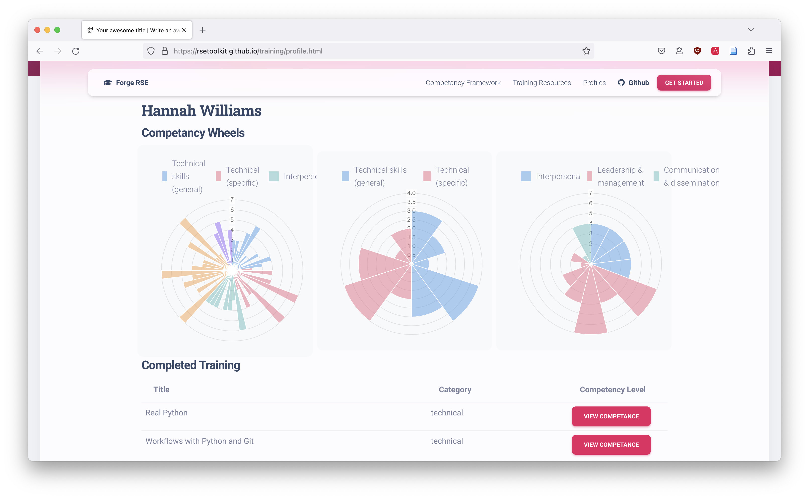

# RSE Competencies Framework

This repository was created from a Software Sustainability Institute Collaborations Workshop 2023 Hack Day. 

The idea is to construct a resource that is for the RSE community and curated by the RSE community. 

**We need your support to get this project to a stage where it can be tested - [see how to contribute](#support-needed)!**

## About



RSE Competencies Toolkit is a resource to support RSEs (Research Software Engineers) in tracking and managing their professional development. It is currently in the early stages of development and we welcome contributions and feedback.

Note that, while we've focussed on RSE during the early stages of development, this tool can be used for any roles. We plan to extend this to other research roles and welcome contributions and collaboration from anyone working in research, broadly defined.

RSE Competencies Toolkit comprises:

1. An RSE competency framework, outlining a structured set of skills that are useful when working as an RSE, with examples of how these skills can be demonstrated at different levels of experience. Not all RSEs will or need to have all skills at all levels.
2. A curated set of training resources, linked to the skills and levels from the competency framework.
3. A tool to visualise and compare different competency profiles.

RSE Competencies Toolkit aims to support the following uses:

1. Recording and visualising your competency profile as an individual RSE
2. Comparing competency profiles across a group of RSEs (e.g. to show the commonalities and variety across RSEs doing the same role at the same level at the same organisation, or comparing across organisations)
3. Find high-quality training resources to improve skills in a particular competency
4. Define aspirational competency profiles, illustrate the gap to your current profile and highlight training resources that could help bridge that gap.

### Current Status

- [x] Initial Research
- [ ] Initial Development <-- You are Here  
- [ ] Minimum viable product 
- [ ] Alpha Release  
- [ ] Feature-Complete Release  

### Support Needed

We need support in the following areas. If you have an hour to contribute, please

#### Defining the skills framework

We have a [draft framework](./_data/skills.json) and a [GitHub issue to track suggestions](https://github.com/RSEToolkit/rse-competencies-toolkit/issues/39).

If you think skills are missing, needs clarification, or could be reorganised within the framework, please add your feedback to the [GitHub issue to track suggestions](https://github.com/RSEToolkit/rse-competencies-toolkit/issues/39).

#### Defining skill levels

We have a [working document on skill levels](https://docs.google.com/document/d/1syrY4gyaAcNuONK0ANUiHgHcbJ3P9RoqSjy57AjUsuM/edit#heading=h.nlkwx70wrmf). Please add feedback as comments in that document.

#### Developing the website

The [website](https://rsetoolkit.github.io/rse-competencies-toolkit/) is currently a basic proof of concept developed during the CW23 Hack Day. We need support to develop a website that can:
* Show descriptions of all the skills
* Display and link the professional development resources curated for each skill
* Allow people to score their own skills and view their skill wheels

#### Curating professional development resources

We have a file with [resources for professional development](./_data/resources.csv) mapped to skills in the framework. 

If you would like to suggest resources to add to the collection, please add them to the [GitHub issue on curation](https://github.com/RSEToolkit/rse-competencies-toolkit/issues/44).

#### All GitHub issues

Anyone is welcome to contribute suggestions, feedback, and/or PRs to address any open issues. You can also open a new issue if your idea is not yet mentioned anywhere else.

### More information
See the [all documents](./all_documents.md) page.

### Project team
See Contributors section below.

You can contact the team at [rse-competencies-toolkit@googlegroups.com](mailto:rse-competencies-toolkit@googlegroups.com).

## Built With

This section is intended to list the frameworks and tools you're using to develop this software. Please link to the home page or documentatation in each case.

### Framework references
- [CSCCE Skills Wheel](https://zenodo.org/record/4437294#.ZFO3F-zMIc1)
- [BCS SFIA Plus](https://www.bcs.org/it-careers/sfiaplus-it-skills-framework/)
- [King's Digital Lab Research Software Careers Learnings](https://zenodo.org/record/2559235)
- [RSE Toolkit](https://rsetoolkit.github.io/)

### Website
- [Jekyll](https://jekyllrb.com/)  
- [Chart.js](https://www.chartjs.org/)  

## Getting Started for Developers

### Prerequisites

- Latest version of [Ruby](https://www.ruby-lang.org/en/)

### Installation

How to build or install the application.

```sh
git clone git@github.com:RSEToolkit/rse-competences-toolkit.git
cd training
bundle install
```

### Running Locally

How to run the application on your local system.

```sh
bundle exec jekyll serve
```

### Running Tests

No tests as yet.

## Deployment

### Local

See [running locally](#running-locally) above.

### Production

Deployed automatically via GitHub actions. 

## Usage

To come after the hack day

## License
Unless otherwise specified on particular materials, all material in this repository is licensed as follows:
- Code is licenced under the [3-clause BSD licence](https://opensource.org/license/bsd-3-clause/)
- Documentation, data and other written material is licensed under the [Creative Commons Attribution licence](https://creativecommons.org/licenses/by/4.0/) (CC-BY 4.0)

## Citation

Please cite this work as follows:

```
@article{RSECompetenciesToolkit2023,
  title={RSE Competencies Toolkit},
  author={RSE Competencies Toolkit team},
  journal={GitHub},
  year={2023}
}
```

## Acknowledgements
The initial version of this repository was created during a Software Sustainability Institute Collaborations Workshop 2023 Hack Day. Subsequent development was guided by a number of unconference sessions during RSECon23.

## Contributors
Contributors (in alphabetical order by first name). Collectively the "RSE Competencies Toolkit team".

- Aleksandra Nenadic
- Aman Goel
- Dave Horsfall 
- Diego Alonso Álvarez 
- Eli Chadwick
- Hannah Williams 
- Iain Barrass
- Lieke de Boer
- Martin O’Reilly
- Matthew Bluteau
- Nadine Spychala
- Paul K Korir
- Sean Marshallsay

## Contact

If you'd like to get in touch with the project team - write to us at [rse-competencies-toolkit@googlegroups.com](mailto:rse-competencies-toolkit@googlegroups.com).
