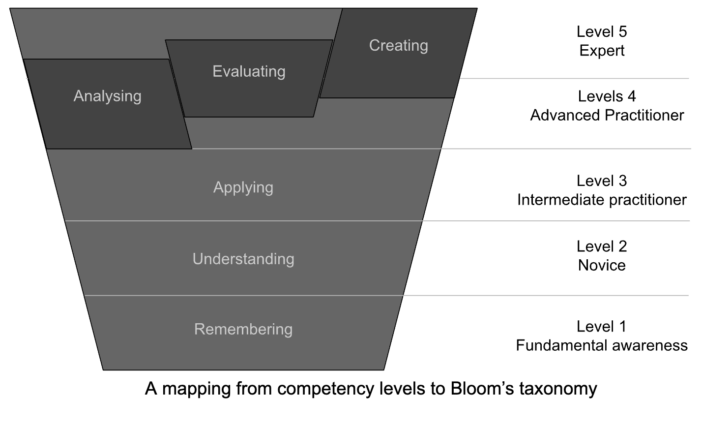

## RSE Competencies Toolkit - Skill Levels Definition

References & inspiration from:

* [Bloom’s for Computing: Enhancing Bloom's Revised Taxonomy with Verbs for Computing Disciplines](https://ccecc.acm.org/files/publications/Blooms-for-Computing-20230807.pdf)
* [Study.com: What is Bloom's Taxonomy?](https://study.com/learn/lesson/blooms-taxonomy-uses-levels-examples.html)
* [SFIA (Skills Framework for the Information Age) guiding principles](https://sfia-online.org/en/about-sfia/sfia-guiding-principles) and [SFIA overview](https://sfia-online.org/en/about-sfia/sfia-overview-for-new-users-211014.pdf)

### Introduction

This document describes a competency scale as a tool to help measure/describe RSEs ability to demonstrate a particular skill or competency (i.e. an individual’s competency level for a particular skill). It can serve as a guide to understanding the expected proficiency at each level (i.e. the expected proficiency of top performers at each level and what an individual is expected to be able to do/aim for at the top of a level). It can be used by an individual to compare, e.g., their current level of proficiency to that of individuals at the level above or top performers at the same level. In addition, when combined with the RSE Competencies framework, this should be a useful tool for curriculum design and planning professional development.

The scale has been heavily inspired by the [NIH Competencies ProficiencyScale](https://hr.nih.gov/working-nih/competencies/competencies-proficiency-scale).
In addition, we tried to (roughly) map each of the levels to the six main categories, or hierarchical levels,
of [Bloom's Taxonomy](https://en.wikipedia.org/wiki/Bloom's_taxonomy) (recap included below), which describe learning objectives
an individual is aiming to achieve at each level:

1. Remembering/Knowledge
2. Understanding/Comprehension
3. Application
4. Analysing
5. Evaluation
6. Creating/Synthesis

[Bloom’s taxonomy as revised by Lorin Anderson in 1990](https://study.com/learn/lesson/blooms-taxonomy-uses-levels-examples.html)  \
(Image credit [Center for Teaching Vanderbilt University @Flickr](https://www.flickr.com/photos/vandycft/29428436431), licence CC BY 2.0)

Mapping to Bloom’s taxonomy should be used to aid the design and development of curricula and defining learning objectives at each skill/competency level as learners advance through the process of learning, from the fundamental stages of remembering and
understanding to the more complex stages of evaluating and creating.

### RSE Competency Scale

We propose the following 5-level competency scale, and the related mapping from a competency level to a category in Bloom’s taxonomy.
Each level is described in terms of what **tasks** people at each level are already capable of performing and what the main **focus**
of people at that level is. While most people at each level will be practising skills across several (adjacent) categories of Bloom’s taxonomy, the focus in this case can be interpreted as what skills people at that level will spend most time and energy developing and practising.

A mapping from competency levels to Bloom’s taxonomy

**Level 0** - None or N/A

* You do not possess this competency or are not required to apply or demonstrate this competency (this competency is not applicable
* to your position).

**Level 1** - Fundamental awareness (basic knowledge)

* You have a common knowledge or an understanding of basic techniques and concepts.
* Focus is on learning and **remembering**.

**Level 2** - Novice (limited experience)

* You have the level of experience gained in a classroom or as a trainee on-the-job. You are expected to need help when performing this competency.
* You understand and can discuss terminology, concepts, principles and issues related to this competency; you can use the full range of
reference and resource materials in this skill.
* Focus is on **understanding**and developing through on-the-job experience.

**Level 3** - Intermediate prctitioner (practical application)

* You are able to successfully complete tasks in this competency as requested. Help from an advanced practitioner/expert may be
required from time to time, but you can usually perform the competency independently.
* You have applied this competency to situations occasionally while needing minimal guidance to perform tasks successfully.
* You understand and can discuss the application and implications of changes to processes and policies in this area.
* Focus is on **applying** well known algorithms, paradigms and solutions to the job at hand and enhancing knowledge or skill.

**Level 4** - Advanced practitioner (applied theory)

* You can perform the actions associated with this skill without assistance. You are certainly recognized within your immediate group/organisation as "a person to ask" when difficult questions arise regarding this skill.
* You have consistently provided practical/relevant ideas and perspectives on process or practice improvements which may easily
be implemented;
* You are capable of mentoring others in the application of this competency by translating complex nuances relating to
this competency into easy to understand terms.
* You participate in the development of reference and resource materials in this competency.
* Focus is on designing or architecting new solutions  - **analysing, evaluating** and **creating/synthesis**.

**Level 5** - Expert (recognized authority)

* You can provide guidance, troubleshoot and answer questions related to this area of expertise and the field where the skill is used.
* You have demonstrated consistent excellence in applying this competency across multiple projects and/or organisations.
* You are being recognised inside and outside your organisation as an authority in the area of the competency.
* You create new applications for and/or lead the development of reference and resource materials for this competency.
* You are able to explain the relevant process elements and issues in sufficient detail during discussions and presentations,
to foster a greater understanding among internal and external colleagues and collaborators.
* Focus is on **strategy** in the area of competency and shaping organisational and (inter)national policies.
